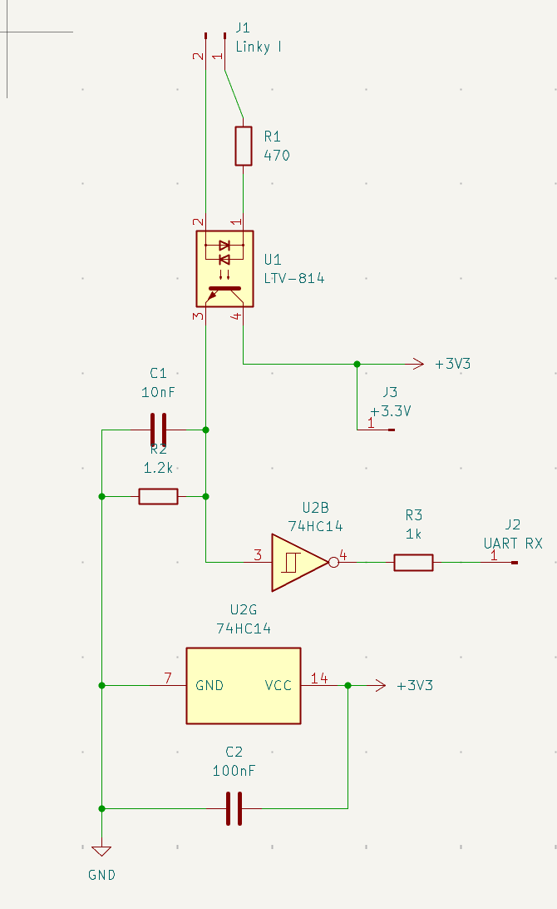
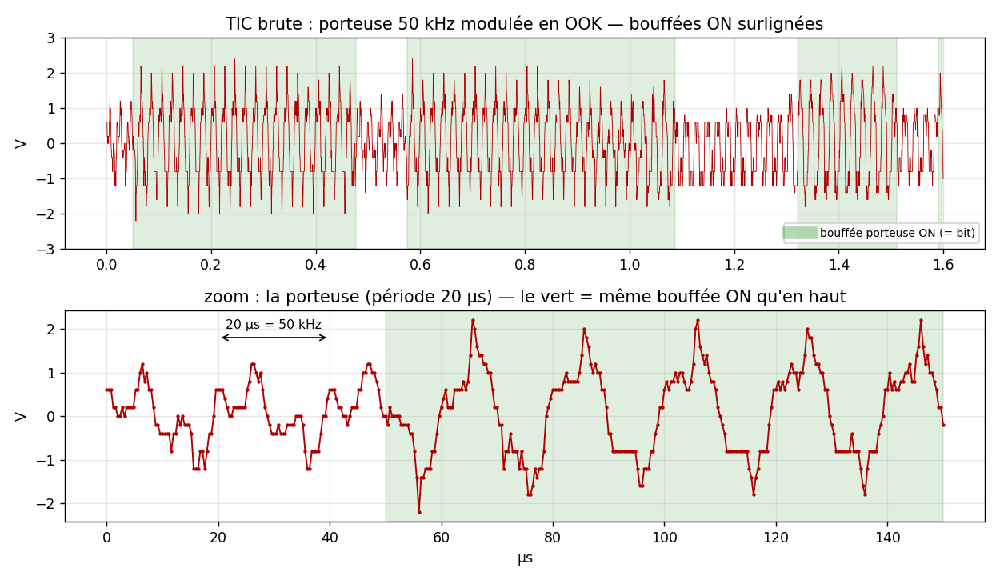
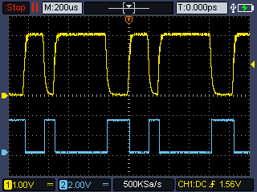
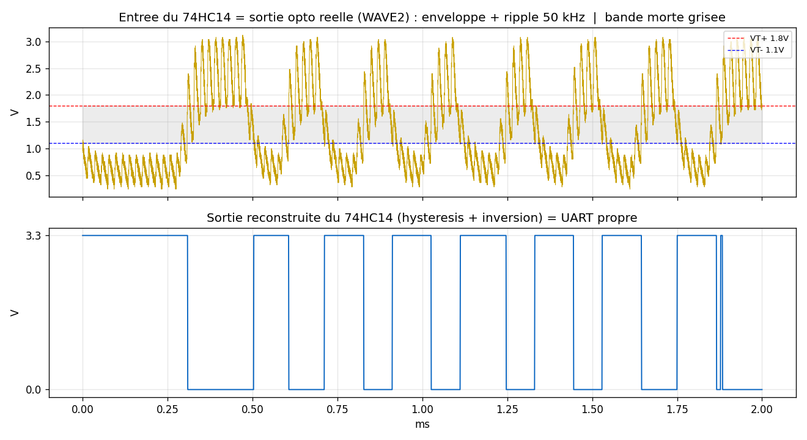

# Front-end TIC filaire — v2 à trigger de Schmitt (74HC14)

Comment le signal télé-info (TIC) du Linky devient un flux série UART lisible par le Pi/Arduino.
Montage de référence : **`pcb/TIC-Reader-Schmitt/`** (schéma `TIC-Reader-Schmitt.net` = source de vérité).

> ℹ️ Le montage **historique (opto + BS170)** reste décrit dans
> [`hardware-tic-front-end.md`](hardware-tic-front-end.md). Ce doc-ci est la **v2** : même opto,
> comparateur remplacé par un **74HC14**.

<p align="center"></p>

---

## 0. Pourquoi cette v2 : on a remplacé le BS170 par un 74HC14

La v1 mettait en forme l'enveloppe démodulée avec un **BS170** (N-MOS en source commune) servant de
comparateur. **Ça marchait, mais c'était fragile** — d'où le passage à un **trigger de Schmitt
74HC14** :

- **Le BS170 n'a PAS d'hystérésis.** C'est un seuil unique (`Vgs(th) ≈ 2 V`). Sur une enveloppe
  **molle** (fronts arrondis par le RC, ripple résiduel de porteuse 50 kHz), un seuil nu **rebascule
  au moindre bruit** autour du point de commutation → bits sales, trames à checksum KO.
- **Le point de commutation dépendait d'un RATIO de résistances marginal** (`R_gate/R_LED`). Il
  fallait le **re-régler entre l'historique (1200 bps) et le standard (9600 bps)**, et même selon la
  vigueur du Linky. Un réglage qui passait en std **cassait** l'histo sur un compteur faible (cf.
  incidents `MissTIC-rev01`, front-end émetteur histo↔std). Front-end **sensible = pannes récurrentes
  « ne lit pas »**.
- **Domaine de tension.** L'ancien montage référençait l'opto sur **+5 V** et comptait sur le BS170
  pour ramener la sortie à 3,3 V (les entrées du Pi ne sont pas 5 V-tolérantes). Une pièce de plus
  à ne pas se tromper.

**Le 74HC14 résout tout ça d'un coup** : c'est un **comparateur à hystérésis** avec deux seuils
définis (`VT+` ≈ 1,4–1,8 V et `VT-` ≈ 0,7–1 V à 3,3 V). Une fois passé `VT+` il faut **redescendre
sous `VT-`** pour rebasculer → **le ripple et le bruit sont ignorés par construction**, plus besoin
de réglage délicat, **un seul montage marche en histo ET en standard**, et tout est en **3,3 V natif**
(plus de domaine 5 V). L'étage de **démodulation (l'opto) est INCHANGÉ** — on n'a remplacé que le
**comparateur** (BS170 → 74HC14).

---

## 1. Ce que sort le Linky : OOK sur porteuse 50 kHz

La TIC n'est **pas** un UART en bande de base. C'est un **flux série UART asynchrone** (format
**7E1**, débit **1200 bps** en historique / **9600 bps** en standard) **modulé en OOK / ASK**
(*On-Off Keying*) sur une **porteuse ~50 kHz** :

- bit d'un état → **bouffée de sinus 50 kHz** présente,
- bit de l'autre état → **silence** (pas de porteuse).

C'est de la modulation d'amplitude, pas de la FSK. La donnée utile est **l'enveloppe** de ces
bouffées.

## 2. La chaîne (montage Schmitt)

```
J1.1 (Linky I1) ──[R1 470Ω]──► U1.1 (LED opto)
J1.2 (Linky I2) ─────────────► U1.2 (LED opto)     ◄── DOMAINE PORTEUSE 50 kHz (isolé)
                                   U1 = opto LTV-814 (entrée AC)
        +3V3 ──► U1.4 (collecteur)
                 U1.3 (émetteur) ──●─────────────► U2.3  (74HC14 entrée, porte 2)
                                   ├──[R2 1.2k]──► GND    (pull-down émetteur-suiveur)
                                   └──[C1 10nF]──► GND    (filtre RC : lissage + réjection porteuse)

        +3V3 ──[C2 100nF]──► GND                          (découplage du 74HC14)

                 U2.4 (74HC14 sortie, porte 2) ──[R3 1k]──► J2.1 (UART RX)   ◄── UART 3,3 V, inversé

   U2 entrées inutilisées (1,5,9,11,13) ──► GND           (jamais laisser flotter une entrée CMOS)
```

| Réf | Valeur | Rôle |
|---|---|---|
| U1 | LTV-814 (opto AC) | **isolation galvanique** + capteur + **détecteur d'enveloppe** |
| R1 | **470 Ω** | courant dans la LED de l'opto — **470 = robuste** (750 était marginal sur Linky faible) |
| U2 | **74HC14** (hex Schmitt) | **comparateur à hystérésis** (1 porte : pin 3 → pin 4) + **inversion** |
| R2 | 1.2 kΩ | pull-down d'émetteur (charge de l'émetteur-suiveur, décharge du nœud) |
| C1 | 10 nF | filtre RC en entrée du Schmitt (avec R2) : lisse le ripple résiduel + tue la porteuse |
| R3 | 1 kΩ | **résistance série de sortie** — 3 rôles : protège l'entrée RX, **permet le flash FTDI** (cf. §5.4 / §7), atténue les pics de commutation |
| C2 | 100 nF | découplage +3V3 du 74HC14 (au plus près de la pin 14) |
| J1 / J2 / J3 | Linky I / UART RX / +3.3V | entrée TIC / sortie série / alim |

> Le montage n'utilise **qu'une seule des 6 portes** du 74HC14 (porte 2 : entrée **pin 3**, sortie
> **pin 4**). Les 5 autres entrées sont **liées à la masse** (netlist : pins 1, 5, 9, 11, 13 → GND),
> leurs sorties laissées en l'air. Piège brochage : à droite du boîtier les E/S sont inversées
> (`1→2 · 3→4 · 5→6` à gauche, `13→12 · 11→10 · 9→8` à droite).

## 3. Où passe-t-on de la porteuse au binaire : DANS l'opto

**Le sinus 50 kHz ne traverse pas l'opto.** Le phototransistor du LTV-814 est **trop lent**
(bande passante chargée **< 50 kHz**) : pendant une bouffée « porteuse présente », la LED pulse à
50 kHz mais le phototransistor ne suit pas → il voit une **lumière moyenne** et conduit à un niveau
**~continu**. Porteuse absente → il se bloque.

→ **La sortie de l'opto suit déjà l'ENVELOPPE** (les bits UART). C'est **la lenteur de l'opto qui
fait l'essentiel de la démodulation** (détection d'enveloppe asynchrone, purement passive). Ici
l'opto est monté en **émetteur-suiveur** (collecteur sur +3V3, émetteur sur R2 vers GND) : le nœud
**monte** quand la porteuse est présente, **retombe** (via R2) quand elle est absente. Le `R2 // C1`
finit de **lisser le ripple résiduel**, et le **Schmitt** fait le reste.

**La porteuse 50 kHz réelle** au point d'entrée (TIC brute, sonde 10X sur le board Schmitt) :

<p align="center"></p>

En haut : la **porteuse 50 kHz** sur 1,6 ms ; les **zones vertes surlignent les bouffées ON** (porteuse
présente = un bit), le blanc = OFF. En bas : le zoom montre le détail de la porteuse (**période 20 µs =
50 kHz**) — le vert démarre à ~50 µs, exactement là où la 1re bouffée reprend en haut ; on **voit** le
contraste d'amplitude OFF (avant, faible) → ON (après, pleine). ⚠️ Mais la modulation reste **subtile**
(le carrier ne s'annule jamais franchement) : le **contraste 0/1 net — les bits lisibles — n'apparaît
qu'APRÈS l'opto** (sa réponse non-linéaire creuse l'écart), cf. figure suivante (sortie opto).

### Vu à l'oscilloscope (2 voies synchronisées : sortie opto vs sortie UART)

Capture d'écran du scope à **200 µs/div** (la porteuse 50 kHz est moyennée à cette base de temps →
on lit directement la donnée). Les 2 voies sont du **même instant** :

<p align="center"></p>

- **CH1 (jaune) = sortie opto** (= entrée du 74HC14, nœud émetteur/RC) : enveloppe démodulée,
  **swing plein 0 → ~3 V**, déjà propre à cette échelle.
- **CH2 (bleu) = sortie vers UART** (sortie du 74HC14) : **créneaux logiques nets et INVERSÉS**
  (jaune haut ⇄ bleu bas, visible en direct).

On voit l'hystérésis + l'inversion faire leur travail : l'entrée molle ressort **carrée et inversée**,
prête pour le RX.

### L'hystérésis en action, sur donnée réelle exportée

En exportant la sortie opto (CSV du scope) et en lui appliquant les seuils du 74HC14 (`VT+` ≈ 1,8 V,
`VT-` ≈ 1,1 V), on **reconstruit** ce que fait le Schmitt — et ça rend le mécanisme limpide :

<p align="center"></p>

- **En haut** : la sortie opto réelle — l'enveloppe OOK (les bits) **noyée dans le ripple 50 kHz**.
  Les deux seuils sont tracés, avec la **bande morte grisée** entre `VT-` et `VT+`.
- **En bas** : la sortie reconstruite du Schmitt (hystérésis + inversion) — **UART parfaitement propre,
  0/3,3 V**, largeurs de bit ~0,1–0,3 ms cohérentes avec du **9600 std** (bit = 104 µs).

**La clé se lit à l'œil** : tant que le signal oscille **dans la bande grise**, la sortie **ne bouge
pas** → tout le ripple 50 kHz qui traverse la zone morte est **ignoré**. La sortie ne bascule que
lorsque l'enveloppe franchit **franchement** `VT+` (→ bas) ou retombe sous `VT-` (→ haut). C'est
**exactement** ce qui manquait au BS170 (seuil unique, pas de bande morte → rebond sur le ripple).

## 4. Le rôle de l'opto (récap, par ordre d'importance)

1. **Isolation galvanique** (fondamental) — seule la lumière traverse : pas de masse commune avec le
   Linky/secteur. Sécurité + conformité TIC. Isolation kV.
2. **Capteur** — le Linky pousse un **courant** dans la LED (via R1) → lumière → phototransistor isolé.
3. **AC** — le LTV-814 encaisse la porteuse **alternative** 50 kHz sans pont redresseur (LEDs
   anti-parallèles en entrée).
4. **Détecteur d'enveloppe** — par sa bande passante finie (cf. §3).

## 5. Le rôle du 74HC14 (comparateur à hystérésis)

Le 74HC14 remplace le BS170 et fait **3** choses, mieux :

1. **Mise en forme avec hystérésis** — au-dessus de `VT+` la sortie bascule bas, et il faut
   **redescendre sous `VT-`** pour rebasculer haut. Cette **bande morte** (`VT+ − VT-` ≈ 0,5–0,8 V à
   3,3 V) **avale le ripple de porteuse et le bruit** → créneaux propres, **zéro rebond parasite**.
   C'est exactement ce qui manquait au BS170 (seuil nu).
2. **Inversion** — le 74HC14 est un inverseur. Le nœud (émetteur-suiveur) est **non inversé** ; la
   sortie du Schmitt est **inversée** → même sens final qu'avec l'ancien BS170 (lui aussi inverseur),
   donc l'UART voit le **même** signal, convention TIC respectée (idle = niveau haut).
3. **3,3 V natif + buffer** — alimenté en 3,3 V, sa sortie ne dépasse jamais 3,3 V → **sûre** pour le
   RX du Pi (pas 5 V-tolérant). Entrée à très haute impédance → ne charge pas le détecteur d'enveloppe
   en amont.

### 5.4 R3 (1 kΩ série) — le détail qui permet le flash FTDI ⚠️

La sortie du 74HC14 attaque **la même ligne que le RX** de l'émetteur (Arduino) / GPIO15 (Pi). Or au
**flash FTDI** de l'Arduino, le programmateur doit **piloter cette ligne RX**. La sortie du Schmitt
est un **push-pull costaud** : sans résistance, elle **maintient la ligne à +3 V** et **écrase** le
FTDI → l'upload échoue (« not in sync », impossible de flasher tant que le front-end est branché).

**R3 = 1 kΩ en série résout ça** : il **adoucit** la sortie du front-end (drive à travers 1 kΩ) →
le FTDI (basse impédance) **prend la main** sur la ligne et le flash passe, **front-end laissé
branché**. Sans R3, il fallait débrancher physiquement le front-end du RX à chaque flash.

Bonus : ce même 1 kΩ, avec la capacité d'entrée du RX, forme un petit RC qui **atténue les pics** de
commutation sur la ligne.

## 6. Le vrai enjeu de dimensionnement

La bande passante effective doit tomber dans une **fenêtre étroite** :

- **assez rapide** pour reproduire l'enveloppe UART → passer ~9,6 kHz en standard (bit = 104 µs),
- **assez lente** pour **tuer** la porteuse 50 kHz.

Soit un facteur **~5** seulement → front-end sensible. Les valeurs validées sur le terrain (100 %
checksum en histo **et** en standard) :

- **R1 = 470 Ω** (courant LED / point de fonctionnement de l'opto). **470 est robuste ; 750 était
  marginal** et décrochait sur un Linky faible. C'est le paramètre n°1.
- **Filtre RC entrée Schmitt : R2 = 1,2 kΩ, C1 = 10 nF** → τ ≈ 12 µs (coupure ~13 kHz). Assez rapide
  pour le 9600 (bit 104 µs, ~8× la constante de temps → fronts nets), assez lent pour lisser le
  résiduel 50 kHz. Monter C1 à **22 nF** rapproche trop la coupure du baud std (à éviter) ; **4,7 nF**
  passe aussi (fronts plus francs, un peu moins de filtrage). **10 nF = le sweet spot.**
- **R3 = 1 kΩ** en série sur la sortie : protège l'entrée RX sans dégrader les fronts.

## 7. Pièges de mise au point (retour d'expérience)

Le nouveau montage est robuste **une fois câblé juste**, mais le débogage de la carte a coûté cher —
à graver :

- **Sortie logique bloquée ≠ puce morte.** Si l'entrée (pin 3) a un beau signal 0–3 V et que la
  sortie (pin 4) reste collée à un niveau, **c'est le BOARD qui la tient** (piste/bande non coupée,
  pont de soudure vers +3V3 ou GND). Changer de puce n'y change **rien** (2 puces = même défaut =
  ce n'est pas la puce). Cas réel : une **bande cuivrée non coupée** reliait pin 4 au +3V3.
- **Pour chercher un court : on SORT la puce.** Puce en place, ses **diodes de protection**
  (entrée/sortie ↔ VCC/GND) font lire des **faux courts** à l'ohmmètre. Hors puce, l'ohmmètre dit la
  vérité, point par point.
- **L'ohmmètre ment sur un rail peuplé/alimenté.** Les **condensateurs de découplage** (C2 100 nF…)
  se chargent → « 0 Ω » fugace ou bip de continuité qui n'est **pas** un court. On juge un court à la
  **tension sous tension + température du régulateur**, pas à l'ohmmètre en circuit.
- **Toujours mesurer référencé à la bonne masse.** Une entrée « à 0–3 V » vue de la mauvaise masse
  peut ne jamais franchir le seuil vu de la **pin 7 (GND)** du 74. Pince de masse **sur pin 7**.
- **Ne jamais laisser une entrée CMOS flotter** — d'où les 5 entrées inutilisées liées à GND.
- **Flash FTDI « not in sync » = contention sur le RX.** Si l'Arduino refuse de se flasher alors
  qu'il est bien câblé, c'est que la sortie du front-end **tient le RX à +3 V** et écrase le FTDI.
  Le **R3 = 1 kΩ série** (cf. §5.4) évite ça — mais si tu bricoles un front-end **sans** ce R3, il
  faut **débrancher le front-end du RX** le temps du flash.

---

> **Sources** : schéma/netlist `pcb/TIC-Reader-Schmitt/TIC-Reader-Schmitt.net` (vérité), image board
> `docs/images/TIC-Reader-Schmitt.png`, capture 2-voies `docs/images/tic-schmitt-2ch.png`.
> Montage historique (opto + BS170) : [`hardware-tic-front-end.md`](hardware-tic-front-end.md).
> Voir aussi `docs/tic-standard-mode.md` (bi-mode histo/standard).
