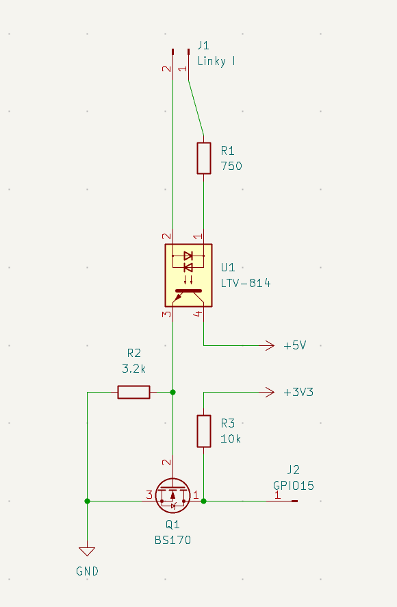

# Front-end TIC filaire — modulation & démodulation

Comment le signal télé-info (TIC) du Linky devient un flux série UART lisible par le Pi.
Montage de référence : `pcb/TIC-Reader-wired/` (schéma `TIC-Reader-wired.net`).

## 1. Ce que sort le Linky : OOK sur porteuse 50 kHz

La TIC n'est **pas** un UART en bande de base. C'est un **flux série UART asynchrone**
(format **7E1**, débit **1200 bps** en historique / **9600 bps** en standard) **modulé en
OOK / ASK** (*On-Off Keying*, tout-ou-rien) sur une **porteuse ~50 kHz** :

- bit d'un état → **bouffée de sinus 50 kHz** présente,
- bit de l'autre état → **silence** (pas de porteuse).

C'est de la modulation d'amplitude, pas de la FSK. La donnée utile est **l'enveloppe**
de ces bouffées.

## 2. La chaîne (montage filaire)



Tracé équivalent :

```
J1 (Linky I1) ──[R1 750Ω]──► U1 pin1 (LED)
J1 (Linky I2) ─────────────► U1 pin2 (LED)      ◄── DOMAINE PORTEUSE 50 kHz (isolé du Pi)
                                 │  U1 = opto LTV-814 (AC/DC)
        +5V ──► U1 pin4 (collecteur)
                U1 pin3 (émetteur) ──► ● Net-(Q1-G) ──[R2 3.2k]──► GND
                                        │  BS170 grille
  +3V3 ──[R3 10k]──► Q1 drain ●─────────► J2 (GPIO15 = RXD du Pi)   ◄── UART BINAIRE 3,3 V
                     Q1 source ──► GND
```

| Réf | Valeur | Rôle |
|---|---|---|
| U1 | LTV-814 (opto AC/DC) | **isolation galvanique** + capteur + **détecteur d'enveloppe** |
| R1 | 750 Ω | limite le courant dans la LED de l'opto (couplage porteuse) |
| Q1 | BS170 (NMOS) | mise en forme + **inversion** → logique 3,3 V propre |
| R2 | 3.2 kΩ | charge de grille (décharge Cgs) : lissage résiduel + seuil |
| R3 | 10 kΩ | pull-up de drain vers +3,3 V (sortie UART) |

## 3. Où passe-t-on de la porteuse au binaire : DANS l'opto

**Le sinus 50 kHz ne traverse pas l'opto.** Le phototransistor du LTV-814 est **trop lent**
(ton/toff ~dizaine de µs, bande passante chargée **< 50 kHz**) : pendant une bouffée
« porteuse présente », la LED pulse à 50 kHz mais le phototransistor ne suit pas → il voit une
**lumière moyenne** et **conduit à un niveau ~continu**. Porteuse absente → il se bloque.

→ **La sortie de l'opto suit déjà l'ENVELOPPE** (les bits UART). C'est **la lenteur de l'opto
qui fait l'essentiel de la démodulation** (détection d'enveloppe **asynchrone / non cohérente**,
purement passive). Le `R2 // Cgrille` et le seuil du BS170 ne font que **finir de lisser le
ripple résiduel et mettre en forme**.

Le **BS170** en source commune (drain tiré à 3,3 V par R3) **inverse** et fournit un UART
logique 3,3 V propre sur GPIO15 (RXD, `ttyAMA0`).

## 4. Le rôle de l'opto (récap, par ordre d'importance)

1. **Isolation galvanique** (rôle fondamental) — seule la lumière traverse la barrière : pas de
   masse commune avec le Linky/secteur. Sécurité + conformité TIC (la sortie télé-info se lit en
   isolé). Un pépin d'un côté ne remonte pas de l'autre (Vce 35 V, isolation kV).
2. **Capteur** — le Linky pousse un **courant** dans la LED (via R1) → lumière → phototransistor
   côté isolé.
3. **AC/DC** — le LTV-814 encaisse la porteuse **alternative** 50 kHz **sans pont redresseur**
   en entrée (une LED d'opto standard ne conduirait qu'une polarité).
4. **Détecteur d'enveloppe** — par sa bande passante finie (cf. §3).

## 5. Le vrai enjeu de dimensionnement

La bande passante effective de l'opto doit tomber dans une **fenêtre étroite** :

- **assez rapide** pour reproduire l'enveloppe UART → passer ~9,6 kHz en standard (bit = 104 µs),
- **assez lente** pour **tuer** la porteuse 50 kHz.

Soit un facteur **~5** seulement entre les deux → front-end **sensible**. `R1` fixe le courant
LED (point de fonctionnement / CTR de l'opto), la charge de sortie fixe la bande passante. Trop
rapide → du 50 kHz bave en sortie ; trop lent → l'enveloppe 9600 bps est écrasée aussi. C'est la
cause racine des réglages histo↔standard (cf. `docs/tic-standard-mode.md`,
`MissTIC-wired-rev01`, et les valeurs de ratio R_LED/R_gate du front-end émetteur).

> Image du board : `docs/TIC-Reader-wired-rev01.png`.
